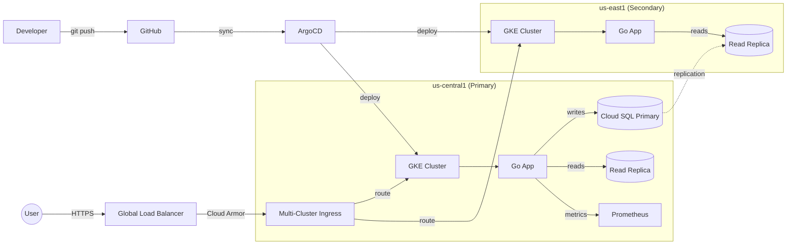
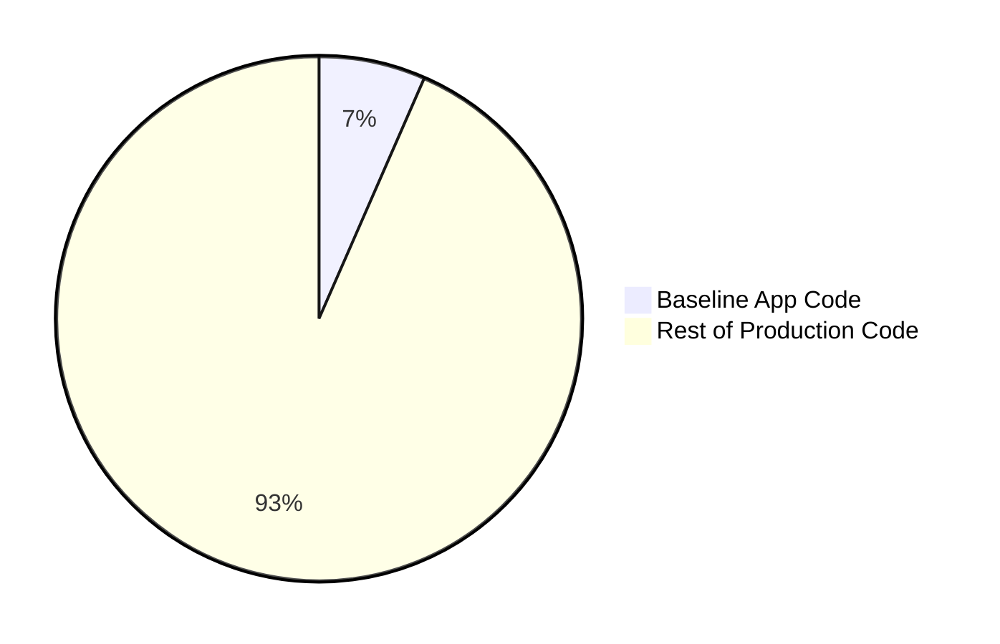

# go-to-production: A Cloud-Native Journey
<br />

[](https://github.com/stevemcghee/go-to-production/actions/workflows/build-test.yml)
[](https://github.com/stevemcghee/go-to-production/actions/workflows/deploy-pages.yml)
[](https://github.com/stevemcghee/go-to-production)
[](https://goreportcard.com/report/github.com/stevemcghee/go-to-production)


> **Note:** This repository focuses on the wrapper, not the candy. The application code is deliberately minimal to highlight the **Infrastructure, Security, and Observability** layers required for production.

## Purpose

This repository is a reference implementation for taking a service to production.
It evolves a simple Go todo app from a local Docker setup to a highly available,
secure, observable, multi-region system — and then keeps going toward
Apollo-program-grade reliability.

This is my response to frameworks and sample code that end with "now just take this to production":


### What You'll Learn

*   How to provision production infrastructure with **Terraform** (GKE, Cloud SQL, IAM, networking)
*   How to secure a service end-to-end: **Workload Identity, Cloud Armor WAF, Binary Authorization, Cosign signing**
*   How to observe a service: **Prometheus metrics, OpenTelemetry tracing, SLOs, burn-rate alerting**
*   How to deploy safely: **ArgoCD GitOps, Argo Rollouts canary, OPA Gatekeeper policy enforcement**
*   How to make a service robust: **circuit breakers, exponential backoff, read replicas, failover**
*   How to think about reliability at scale: **multi-region, multi-cloud, cell architecture, formal verification**

## Quick Start

**Run Locally (No Cloud):**
```bash
git checkout tags/milestone-00-baseline
docker-compose up
```
See [Milestone 0 Docs](docs/00_BASELINE.md) for details.

**Explore the Production State:**
The `main` branch contains the full cloud-native implementation.
*   **Infrastructure**: `terraform/` — GKE, Cloud SQL, IAM, monitoring, security policies
*   **Kubernetes**: `k8s/` — Kustomize base + region overlays, Argo Rollouts, Gatekeeper policies
*   **CI/CD**: `.github/workflows/build-test.yml` — build, test, sign, scan, push
*   **GitOps**: `argocd-todo-app.yaml` — ArgoCD sync for multi-cluster deployment

## How It Works: Time Travel

This repo uses **Git Tags** to let you step through the evolution of a service.

```bash
git tag -l                                    # List all milestones
git checkout tags/milestone-02-base-infra     # See the code at that point
git checkout main                             # Return to latest
```

## Architecture

Current production state: multi-region, GitOps-managed, with canary deployments.



## The Iceberg: Infrastructure > Code

Transforming a toy app into a production system requires a massive investment
in infrastructure and documentation.

*   For every **1 line** of application code, we wrote **2 lines of Infrastructure as Code** and **3.5 lines of Documentation**.
*   IaC grew by **25x** from start to finish. ([Full Analysis](docs/REPO_ANALYSIS.md))




## Milestones

### Completed (0–12)

| # | Milestone | Tag | What It Adds |
|:--|:----------|:----|:-------------|
| 0 | Baseline | `milestone-00-baseline` | Go app + Docker Compose. [Docs](docs/00_BASELINE.md) |
| 1 | Risk Analysis | `milestone-01-risk-analysis` | Risk matrix & implementation plan. [Docs](docs/01_RISK_ANALYSIS.md) |
| 2 | Base Infra | `milestone-02-base-infra` | GKE, Cloud SQL, CI/CD. [Docs](docs/02_BASE_INFRASTRUCTURE.md) |
| 3 | HA & Scale | `milestone-03-ha-scale` | Regional GKE, HA Cloud SQL, HPA. [Docs](docs/03_HA_SCALABILITY.md) |
| 4 | IAM Auth | `milestone-04-iam-auth` | Workload Identity, Cloud SQL IAM Auth. [Docs](docs/04_IAM_AUTH_AND_SECRETS.md) |
| 5 | Security | `milestone-05-security-hardening` | Cloud Armor WAF, HTTPS, CSP. [Docs](docs/05_SECURITY_HARDENING.md) |
| 6 | Adv. Deploy | `milestone-06-advanced-deployment` | Cloud Deploy, canary releases. [Docs](docs/06_ADVANCED_DEPLOYMENT.md) |
| 7 | Observability | `milestone-07-observability-metrics` | Prometheus metrics. [Docs](docs/07_OBSERVABILITY_METRICS.md) |
| 8 | Robustness | `milestone-08-robustness-slos` | Circuit breakers, SLOs, error budgets. [Docs](docs/08_ROBUSTNESS_SLOS.md) |
| 9 | Tracing | `milestone-09-tracing-polish` | OpenTelemetry + Cloud Trace. [Docs](docs/09_TRACING_AND_POLISH.md) |
| 10 | GitOps | `milestone-10-gitops` | ArgoCD, Dependabot, secret scanning. [Docs](docs/10_GITOPS_AND_AUTOMATION.md) |
| 11 | Policy | `milestone-11-policy-rollouts` | OPA Gatekeeper, Argo Rollouts, PDB. [Docs](docs/11_POLICY_AND_ROLLOUTS.md) |
| 12 | Supply Chain | `milestone-12-supply-chain` | Cosign signing, Binary Authorization. [Docs](docs/12_SUPPLY_CHAIN_SECURITY.md) |

### In Progress

| # | Milestone | Status | What It Adds |
|:--|:----------|:-------|:-------------|
| 13 | Multi-Region | Infra deployed; verification remaining | Second GKE cluster, Cloud SQL replica, Multi-Cluster Ingress. [Docs](docs/13_MULTI_REGION_PLAN.md) |

### Planned (14–16)

| # | Milestone | What It Adds |
|:--|:----------|:-------------|
| 14 | Operational Resilience | Log redaction, quota alerts, budget caps, backup drills, audit. [Docs](docs/14_OPERATIONAL_RESILIENCE.md) |
| 15 | Adv. Observability | Trace-log correlation, business SLIs, Chaos Mesh, playbooks. [Docs](docs/15_ADVANCED_OBSERVABILITY.md) |
| 16 | Cost Optimization | Autoscaling tuning, right-sizing, CUDs, cost dashboard. [Docs](docs/16_COST_OPTIMIZATION.md) |

### Aspirational: The Apollo Program for Cloud (17–22)

> *No single cloud. No single codebase. No single point of failure at any layer — including the software itself.*

| # | Milestone | Goal |
|:--|:----------|:-----|
| 17 | [Multi-Cloud Active-Active](docs/17_MULTI_CLOUD.md) | GCP + AWS serving traffic simultaneously; survive a total provider outage |
| 18 | [N-Version Redundancy](docs/18_EXTREME_RELIABILITY.md) | Two independent API implementations (Go + Rust) with a comparison proxy |
| 19 | [Autonomous Self-Healing](docs/18_EXTREME_RELIABILITY.md) | Gray failure detection + Kubernetes Operator that runs the runbook automatically |
| 20 | [Cell-Based Architecture](docs/18_EXTREME_RELIABILITY.md) | Shuffle-sharded user isolation — blast radius = 1/N |
| 21 | [Formal Verification](docs/18_EXTREME_RELIABILITY.md) | TLA+ specs, property-based testing, deterministic reproducible builds |
| 22 | [Digital Twin](docs/18_EXTREME_RELIABILITY.md) | Shadow environment validated against real traffic; pre-deployment gate |

See the [Reliability Ladder](docs/STRATEGY_AND_RISKS.md#estimates--nines) for how each milestone moves the needle from 99.9% to provably correct.

## Reliability & Operations

*   **[Strategy & Risks](docs/STRATEGY_AND_RISKS.md)**: Risk matrix with mitigation status for every identified risk.
*   **[Runbook](docs/RUNBOOK.md)**: Rollback procedures, troubleshooting, disaster recovery, chaos experiments.

**Risks Mitigated:** Bad deployments (canary + rollback), zone failure (regional HA), DDoS (Cloud Armor), supply chain (Cosign + Binary Auth), secrets leakage (gitleaks), config drift (ArgoCD + Gatekeeper).

**Open Risks (Milestone 14):** Quota exhaustion, billing spikes, sensitive data in logs, backup restore validation, insider threat, ransomware.

## Estimated Daily Costs

| Phase | Est. Daily Cost | What Changed |
|:------|:----------------|:-------------|
| Baseline (M0) | $0.00 | Local Docker only |
| Base Infra (M2) | ~$6.00 | GKE + Cloud SQL provisioned |
| HA & Scale (M3) | ~$15.00 | Regional GKE (3 zones), HA Cloud SQL + replica |
| Observability (M7–9) | ~$16.50 | Cloud Trace, logging volume |
| GitOps + Policy (M10–11) | **~$17.00** | ArgoCD, Gatekeeper, GKE Backup |
| Multi-Region (M13) | **~$34.00** | Second cluster + replica (est.) |


## Technologies

*   **Language**: Go 1.24 (standard library `net/http`)
*   **Database**: PostgreSQL (Cloud SQL HA + read replica)
*   **Infrastructure**: Terraform, GKE, Kustomize
*   **Deployment**: ArgoCD (GitOps), Argo Rollouts (canary)
*   **Observability**: Prometheus, OpenTelemetry, Cloud Trace, Cloud Monitoring
*   **Security**: Workload Identity, Cloud Armor, Binary Authorization, Cosign, OPA Gatekeeper, Secret Manager

## Testing

Unit, integration, and chaos/resilience tests. See **[docs/TESTING.md](docs/TESTING.md)**.

```bash
go test -v ./...                  # All tests
go test -v ./test/chaos/...       # Chaos tests only
```

---

**[100 - Go To Space](https://stevemcghee.github.io/go-to-production/game/)** — interactive SRE simulation illustrating SLOs, error budgets, and infrastructure automation.

> **Note on Branch Protection:** This educational repo leaves `main` unprotected to allow direct milestone pushes. In production, branch protection is mandatory.
